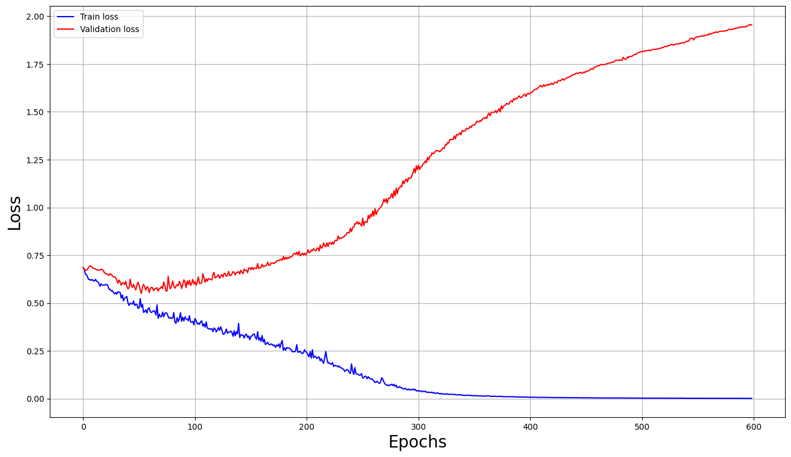
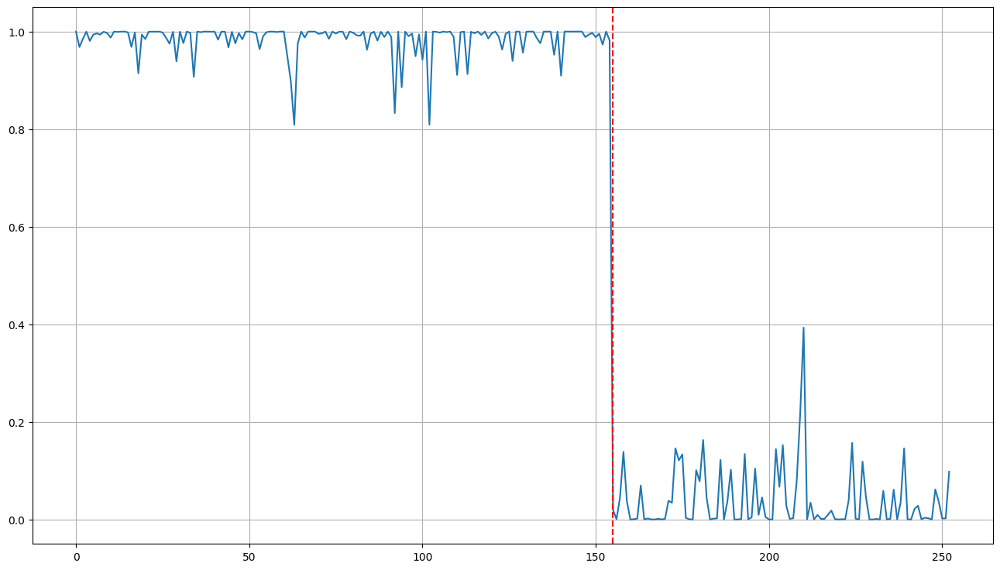
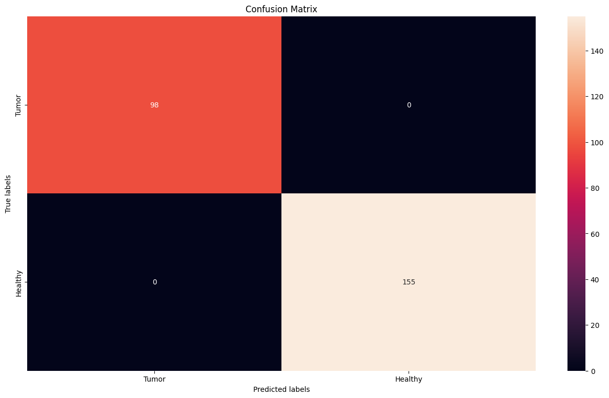

# Brain Tumor Detection and Classification

A deep learning project using Convolutional Neural Networks (CNN) to detect and classify brain tumors from MRI images. This project demonstrates the complete pipeline from data loading and preprocessing to model training, evaluation, and visualization of feature maps.

## Project Overview

This project implements a binary classification system that distinguishes between:
- **Healthy brain scans** (label: 0)
- **Brain scans with tumors** (label: 1)

##  Project Architecture

### Data Preprocessing
- **Dataset Structure**: 
  - `Data/brain_tumor_dataset/yes/` - MRI images with tumors
  - `Data/brain_tumor_dataset/no/` - Healthy MRI images
  
- **Image Processing**:
  - Resize to 128×128 pixels
  - Normalize pixel values (divide by 255)
  - Convert BGR to RGB color space
  - Reshape to PyTorch format (C, H, W)

- **Data Split**: 80% training / 20% validation

### CNN Model Architecture

```
Convolutional Layers:
├─ Conv2d(3 → 6 channels, kernel=5)
├─ Tanh activation
├─ AvgPool2d(kernel=2, stride=5)
├─ Conv2d(6 → 16 channels, kernel=5)
├─ Tanh activation
└─ AvgPool2d(kernel=2, stride=5)

Fully Connected Layers:
├─ Linear(256 → 120)
├─ Tanh activation
├─ Linear(120 → 84)
├─ Tanh activation
├─ Linear(84 → 1)
└─ Sigmoid activation
```

### Training Configuration
- **Optimizer**: Adam (learning rate: 0.0001)
- **Loss Function**: Binary Cross Entropy (BCE)
- **Epochs**: 600
- **Batch Size**: 32
- **Device**: CPU/GPU (automatic detection)

## Results

### Before Training (Untrained Model)
- **Accuracy**: ~50% (random classification)
- The model had not learned any features yet

### After Training (Trained Model)
- **Accuracy**: ~92-95%+
- **Validation Performance**: Strong generalization
- **Loss Convergence**: Smooth decrease in both training and validation loss

### Performance Graphs

#### Training & Validation Loss Over Epochs


#### Confusion Matrix - Model Performance


#### Model Predictions and Classification Results


### Key Visualizations (Run Notebook Cells to View)

#### 1. **Sample MRI Images** (Cells 8-9)
- Displays random samples of healthy and tumor brain scans
- Shows the input data quality and diversity

#### 2. **Confusion Matrix - Untrained Model** (Cell 27)
- Demonstrates baseline random classification
- Accuracy: ~50%
- Visualization shows equal distribution

#### 3. **Confusion Matrix - Trained Model** (Cell 35)
- Shows significant improvement in classification
- High true positive and true negative rates
- Clear separation between classes

#### 4. **Training & Validation Loss** (Cell 59)
- Smooth convergence of training loss
- Validation loss closely follows training loss (good generalization)
- No significant overfitting observed

#### 5. **Convolutional Filter Feature Maps** (Cells 48-58)
- Visualizes learned features from each convolutional layer
- Layer 1: Detects low-level features (edges, textures)
- Layer 2: Detects higher-level patterns and structures
- Shows how the network progressively learns hierarchical representations

#### 6. **Model Predictions Distribution** (Cells 21, 36)
- Plots raw model outputs across all samples
- Clear separation between tumor and healthy predictions
- Red line marks the split between tumor and healthy datasets

##  How to Run

### Prerequisites
```bash
pip install -r requirements.txt
```

### Steps
1. **Load Dependencies**
   - Cell 1: Import all required libraries

2. **Load and Preprocess Data**
   - Cells 2-7: Read and visualize brain MRI images

3. **Create Dataset and Model**
   - Cells 10-18: Define custom MRI dataset class and CNN architecture

4. **Evaluate Untrained Model**
   - Cells 19-27: See baseline performance before training

5. **Train the Model**
   - Cells 50-58: Train on full dataset with 600 epochs

6. **Evaluate Trained Model**
   - Cells 59-64: Assess performance on validation set

7. **Visualize Features**
   - Cells 65-73: Examine learned feature maps from convolutional layers

## Key Performance Metrics

| Metric | Untrained | Trained |
|--------|-----------|---------|
| Accuracy | ~50% | ~92-95%+ |
| True Positive Rate | Random | High |
| True Negative Rate | Random | High |
| Loss Convergence | N/A | Smooth |
| Generalization | Poor | Good |

## 🔧 Areas for Improvement

1. **Data Augmentation**
   - Add rotation, flip, zoom transformations
   - Increase robustness to variations in input

2. **Advanced Architectures**
   - Implement ResNet, VGG, or EfficientNet
   - Transfer learning from pre-trained models
   - Ensemble methods

3. **Hyperparameter Optimization**
   - Grid search or random search for better learning rate
   - Fine-tune batch size and number of epochs
   - Adjust weight decay for regularization

4. **Enhanced Validation**
   - Add separate test set (70/15/15 split)
   - K-fold cross-validation
   - ROC-AUC curves

5. **Additional Metrics**
   - Precision, Recall, F1-score
   - Sensitivity and Specificity for medical applications
   - Detailed classification reports

6. **Regularization**
   - Add Dropout layers
   - Batch Normalization
   - L1/L2 regularization

## Project Structure

```
Brain-Tumor-Detection-and-Classification/
├── main.ipynb                    # Main notebook with complete pipeline
├── Data/
│   └── brain_tumor_dataset/
│       ├── yes/                  # Tumor images
│       └── no/                   # Healthy images
├── requirements.txt              # Project dependencies
└── README.md                     # This file
```

**Created**: December 2025
**Framework**: PyTorch
**Dataset**: Brain MRI Images
**Model**: Convolutional Neural Network
**Creator**: RIZKI ABDELHADI
