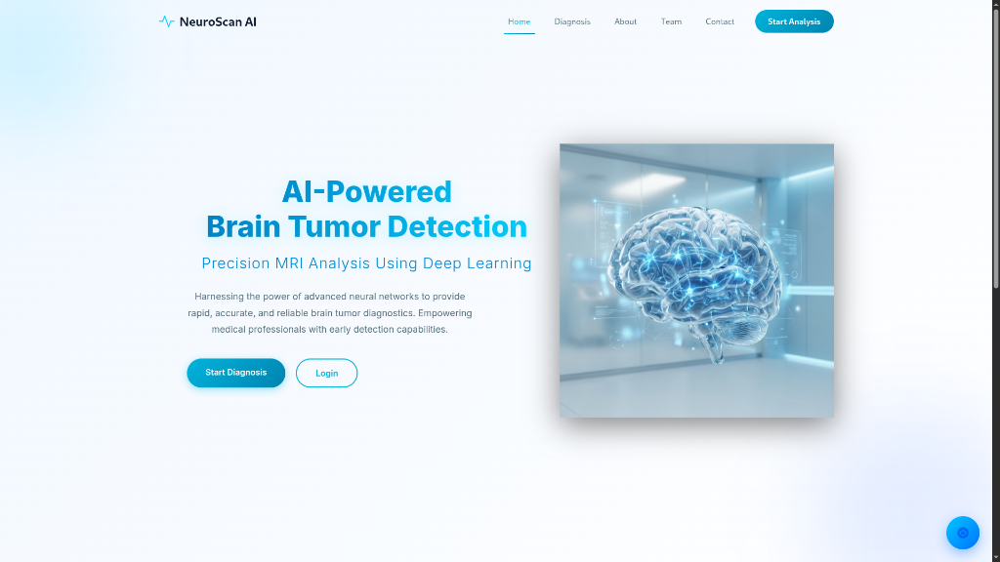
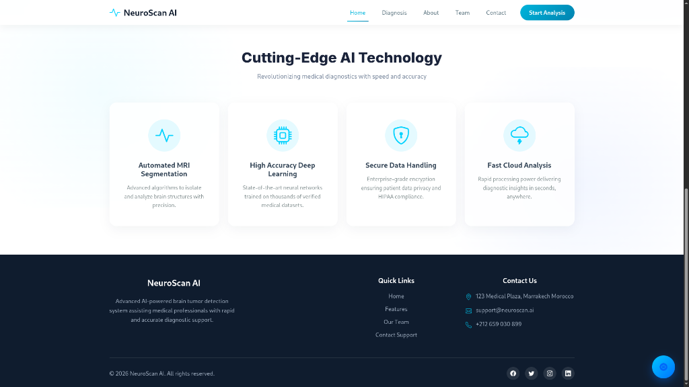
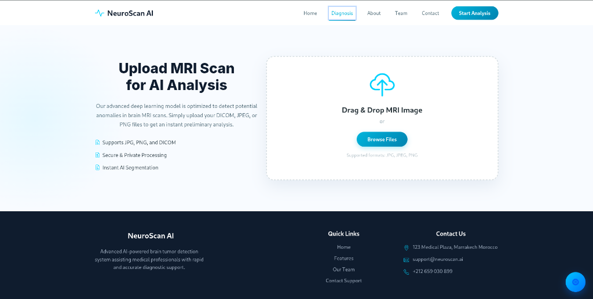
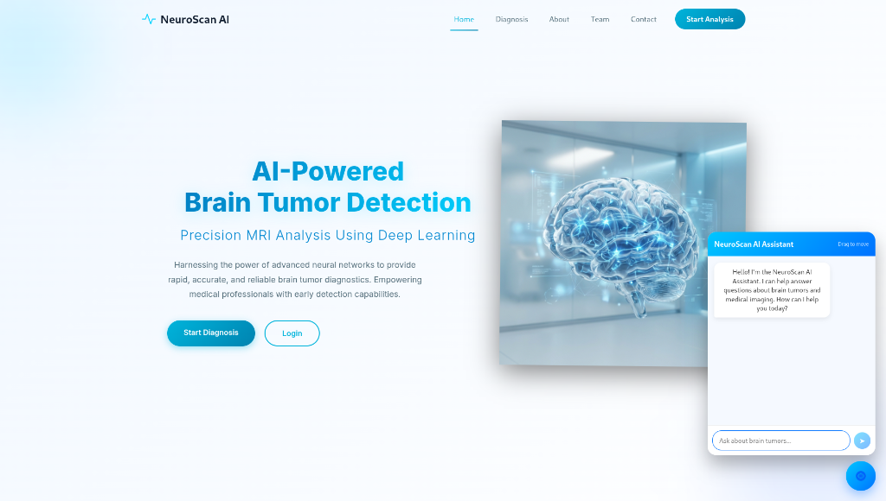
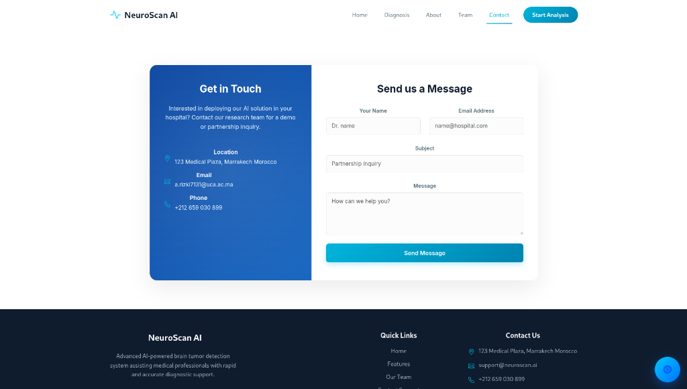

# NeuroScan AI - Brain Tumor Detection Web Application

NeuroScan AI is a cutting-edge medical diagnostic tool that leverages advanced deep learning algorithms to assist medical professionals in detecting brain tumors from MRI scans with high precision and speed.

## 🚀 Key Features

- **Automated MRI Segmentation:** Precise identification and localization of potential brain tumors.
- **Deep Learning Accuracy:** Powered by state-of-the-art neural networks trained on extensive medical datasets.
- **Real-time Diagnostic Feedback:** Instant preliminary reports based on uploaded MRI images.
- **Interactive AI Assistant:** A smart chatbot to answer questions about brain tumors and medical imaging.
- **Secure Data Handling:** Enterprise-grade encryption ensuring patient data privacy and HIPAA compliance.

## 📸 Screenshots

### Home Page


### Intelligent Features


### AI-Powered Diagnosis


### Smart AI Assistant


### Get in Touch


## 🛠️ Technology Stack

### Frontend
- **React.js**: For building a dynamic and responsive user interface.
- **Vanilla CSS**: Custom, premium styling for a modern medical aesthetic.
- **Framer Motion**: For smooth page transitions and micro-animations.

### Backend
- **FastAPI**: A high-performance Python web framework for the API layer.
- **PyTorch/ONNX**: For deep learning model inference.
- **PostgreSQL**: For secure and scalable data storage.

## 📂 Project Structure

```text
Brain-Tumor-WebApp/
├── assets/             # Project screenshots and media
├── backend/            # FastAPI backend application
│   ├── app/            # Core application logic
│   └── main.py         # Backend entry point
├── frontend/           # React frontend application
│   ├── src/            # Source code
│   └── public/         # Static assets
└── requirements.txt    # Python dependencies
```

## ⚙️ Installation

### Backend Setup
1. Navigate to the `backend` directory.
2. Create and activate a virtual environment.
3. Install dependencies: `pip install -r requirements.txt`
4. Run the server: `python main.py`

### Frontend Setup
1. Navigate to the `frontend` directory.
2. Install dependencies: `npm install`
3. Start the development server: `npm run dev`

---
© 2026 NeuroScan AI. All rights reserved.
